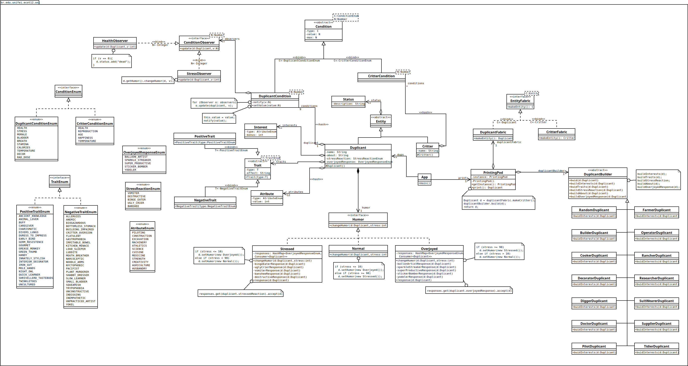

# Oxygen Not Included Characters Generator

This project was developed as part of the **Software Project** course in the Computer Engineering program at **UNIFEI**. The goal was to model a game and implement its prototype. The chosen game was *Oxygen Not Included*, with a specific focus on generating in-game characters.

## Features

- **Character Generation**:
  - Randomly generate unique characters with diverse traits, attributes, and conditions.
  - Traits include personality, skills, stress tolerance, and health conditions.
  - Attributes are customizable to fit specific roles or scenarios.

- **Observer Pattern**:
  - Dynamically react to changes in character conditions, such as stress levels or health status.
  - Automatically update character states and notify relevant components in real-time.

- **Customizable Builders**:
  - Create characters tailored to specific roles, such as researchers, cooks, or builders.
  - Option to generate completely random profiles for variety and unpredictability.

- **Extensibility**:
  - Easily add new traits, roles, or conditions to expand the character generation system.
  - Modular design allows for seamless integration of new features.

## Technologies Used

- **Java 17**: Core programming language.
- **Maven**: Build and dependency management tool.

## UML Diagram

Below is the UML diagram representing the structure of the project:

## Project Structure

- **`src/main/java`**: Contains the main application code, including character generation logic, database entities, and GUI classes.
- **`src/test`**: Reserved for unit tests (currently empty).

## License

This project is licensed under the MIT License. See the [LICENSE](LICENSE) file for details.
